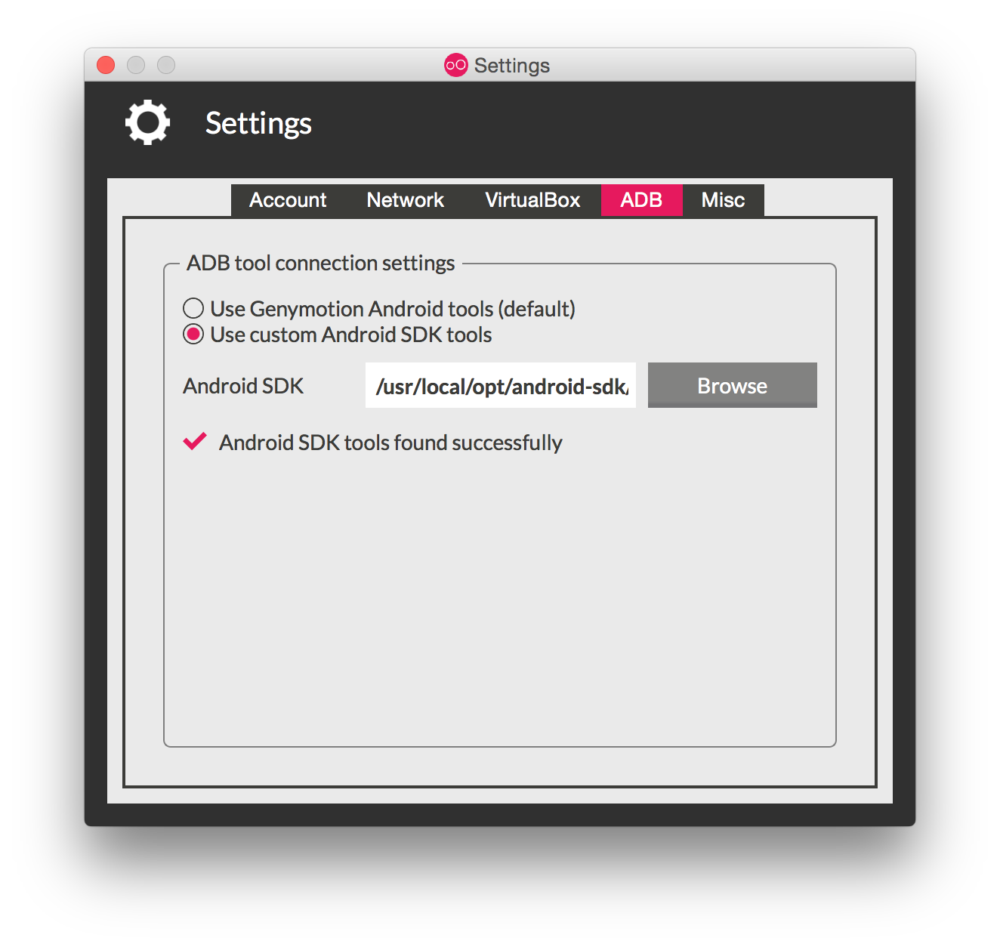

We recommend the Genymotion emulator over the Android Studio emulator. If you run into any problems using Genymotion, follow the steps in this guide.

## Step 1: Use the same version of the Android tools everywhere

Genymotion and XDE/`exp` both bundle their own versions of the Android tools. In order for XDE or `exp` to communicate with Genymotion they need to share the same set of tools. You can do this by either telling XDE/`exp` to use Genymotion's tools, or by installing Android Studio and telling both XDE/`exp` and Genymotion to use the tools from Android Studio.

Choose one of these two options:

### Option 1: Use Android Studio's tools

-   Install Android Studio.

-   Go to Configure -> SDK Manager.

-   In SDK Manager, make sure you are in Appearance & Behaviour -> System Settings -> Android SDK.
   Your SDK and tools are in the box that says Android SDK Location. Remember this location!

-   If you are on macOS or Linux, add the Android SDK location to your PATH using `~/.bash_profile` or `~/.bash_rc`.

-   On macOS, you will also need to add `platform-tools` to your `~/.bash_profile` or `~/.bash_rc.`, by adding a line like `export PATH=/Users/myuser/Library/Android/sdk/platform-tools:$PATH`

-   Make sure that you can run `adb` from your terminal.

-   Open Genymotion and navigate to Settings -> ADB. Select "Use custom Android SDK tools" and update with your Android SDK location:

-   Start Genymotion

### Option 2: Use Genymotion's tools

-   Find Genymotion's copy of `adb`. On macOS this is normally `/Applications/Genymotion.app/Contents/MacOS/tools/`.
-   Add the Genymotion tools directory to your path.
-   Make sure that you can run `adb` from your terminal.

## Step 2: Set your path in XDE

Run `npm install -g exp` to install `exp` globally.

Then run `exp path`. This will save your `PATH` environment variable so that XDE knows where to find your Android tools.
